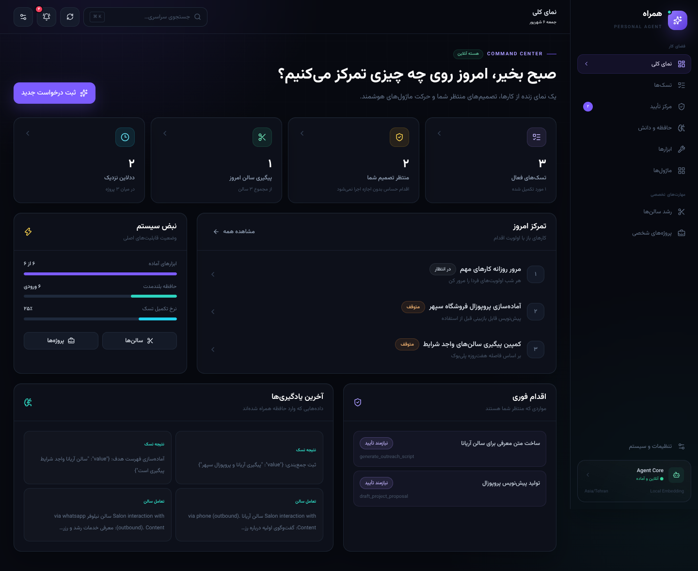

# همراه — هسته دستیار هوشمند شخصی

یک دستیار لوکال و تک‌کاربره با حافظه بلندمدت، برنامه‌ریز Gemini، لایه تأیید اقدام‌ها، زمان‌بندی روزانه و دو Skill مستقل برای بازاریابی سالن‌ها و مدیریت پروژه‌های شخصی/فریلنس.

## قابلیت‌ها

- دریافت تسک طبیعی، شکستن آن به قدم‌ها و اجرای ترتیبی ابزارها
- برنامه تحویل روزانه: تخصیص یک‌تسک-در-روز از فردا، یادآوری ۸ صبح و گزارش‌گیری شبانه (داشبورد + تلگرام)
- پیش‌نمایش فوری متن‌ها: «ساخت متن پیگیری/معرفی» و «پروپوزال» همان‌جا در ماژول نمایش داده می‌شوند
- چند کلید Gemini با چرخش خودکار: قطع یا محدود شدن یک کلید، تسک را متوقف نمی‌کند و کلید سالم جایگزین می‌شود
- توقف قطعی پیش از ابزارهای نیازمند تأیید و ادامه خودکار پس از تأیید
- ثبت تمام فراخوانی‌های AI، شامل تلاش‌های ناموفق و retry
- حافظه برداری بلندمدت و جست‌وجوی cosine
- بارگذاری و chunk کردن پلی‌بوک‌ها
- ذخیره خودکار نتیجه قدم‌های تکمیل‌شده در حافظه
- اجرای روزانه تسک‌های تکرارشونده با APScheduler
- ماژول سالن: Bulk Import، تعامل‌ها، اسکریپت ارتباطی و cadence طبق پلی‌بوک
- ماژول شخصی: پروژه‌ها، transition وضعیت، پروپوزال و یادآوری سه‌روزه
- داشبورد حرفه‌ای فارسی، تیره، واکنش‌گرا و کاملاً RTL با فونت Vazirmatn داخلی
- نمای فرماندهی، جستجوی سراسری، اعلان‌ها، Toast، تنظیم Auto-refresh و وضعیت واقعی سرویس‌ها
- **همـراه شناور همیشه‌درکنار**: پنل گفتگوی شیشه‌ای کنار دسکتاپ روی همه صفحات + لانچر جمع‌شونده، حالت بزرگ‌شده، ورودی صوتی فارسی، توقف تولید پاسخ، کپی پاسخ و حافظه‌ی وضعیت باز/بسته
- مدیریت واقعی Task/Step شامل ویرایش، حذف، قدم دستی، اجرای مسیر و اجرای فوری تسک تکرارشونده
- مدیریت کامل سالن شامل CRUD، ورود گروهی CSV/JSON، تاریخچه تعامل و ساخت متن معرفی
- مدیریت کامل پروژه شامل CRUD، transition معتبر وضعیت و ساخت پروپوزال تأییدمحور
- جستجوی معنایی و حذف حافظه، مدیریت پلی‌بوک و اجرای آزمایشی ابزارهای عمومی
- بدون لاگین؛ مناسب یک کاربر روی دستگاه محلی

## شروع سریع

### Linux / macOS

```bash
./setup.sh
./start_app.sh
```

### Windows

```bat
setup.bat
start_app.bat
```

سپس باز کنید:

- داشبورد: <http://127.0.0.1:8000>
- مستندات تعاملی API: <http://127.0.0.1:8000/docs>
- Health check: <http://127.0.0.1:8000/api/health>

Dashboard و API عمداً از یک process، یک origin و یک پورت سرو می‌شوند؛ بنابراین مرورگر به Vite proxy یا Backend جداگانه وابسته نیست.

برای اجرای خودکار در ورود Windows، راهنمای [`docs/WINDOWS_STARTUP.md`](docs/WINDOWS_STARTUP.md) را ببینید.

## تنظیم Gemini

روش پیشنهادی نیازی به ویرایش Backend ندارد:

1. در Dashboard وارد **تنظیمات و سیستم ← اتصال امن Gemini** شوید.
2. یک Auth key جدید از [Google AI Studio](https://aistudio.google.com/api-keys) بسازید.
3. کلید را وارد و «اعتبارسنجی و افزودن به چرخش» را بزنید.

Backend ابتدا کلید را مستقیماً با Google بررسی می‌کند؛ فقط در صورت موفقیت آن را با Fernet رمز کرده و در SQLite ذخیره می‌کند. کلید رمزگشایی در فایل محلی با permission `0600` قرار می‌گیرد و مقدار خام هیچ‌وقت در status، log یا پاسخ Frontend برگردانده نمی‌شود.

## برنامه تحویل روزانه (Daily Plan)

در «نمای کلی ← برنامه تحویل روزانه»:

- **از فردا، روزی یک تسک**: دکمه تخصیص، تسک‌های بازِ بدون زمان تحویل را از فردا هر روز یکی به آن‌ها ددلاین می‌دهد (ستون `due_at` روی تسک، بدون خرابی دیتای قدیمی — migration خودکار).
- **یادآوری صبح ۸:۰۰** (به وقت ایران/`AGENT_TIMEZONE`): اعلان داشبورد با فهرست کارهای امروز + در صورت تنظیم بودن مخاطب تلگرام، پیام личی.
- **گزارش شبانه ۲۱:۰۰**: همراه گزارش روز را می‌خواهد؛ متن گزارش در همان کارت یا از طریق چت (ابزار `submit_daily_report`) ثبت و نگهداری می‌شود.
- ساعت‌ها و فعال/غیرفعال بودن قابل تنظیم است (`PUT /api/daily/settings`) و هر اعلان در روز فقط یک‌بار ساخته می‌شود (idempotent).

### پایداری پاسخ همراه

اگر Gemini بعد از اجرای موفق ابزارها قطع شود، دیگر خطای «ارتباط قطع شد» نمی‌بینید؛ نتیجه کارهای انجام‌شده با خلاصه‌شان برمی‌گردد. با چند کلید Gemini این حالت تقریباً منتفی است.

### چند کلید Gemini با چرخش خودکار (Key Rotation)

می‌توانید تا **۱۰ کلید** Gemini ثبت کنید (دکمه «اعتبارسنجی و افزودن به چرخش» هر بار یک کلید جدید اضافه می‌کند):

- اگر کلید فعال به **محدودیت نرخ (429)** بخورد → ۶۰ ثانیه به بعد می‌رود و بلافاصله کلید بعدی امتحان می‌شود؛ **تسک کاربر قطع نمی‌شود**.
- **اتمام سهمیه (Quota)** → آن کلید ۵ دقیقه کنار گذاشته می‌شود و کلید بعدی جایگزین می‌شود.
- **رد شدن کلید (401/403)** → آن کلید ۱۵ دقیقه کنار گذاشته می‌شود.
- آخرین کلیدی که با موفقیت جواب داده «کلید متصل/فعال» است و فراخوانی‌های بعدی از همان شروع می‌شوند.
- اگر فقط یک کلید داشته باشید، رفتار قبلی (Retry با Backoff روی همان کلید) حفظ می‌شود.
- در Dashboard لیست کلیدها با ۴ رقم آخر، وضعیت (فعال / استراحت موقت) و دکمه حذف تک‌تک نمایش داده می‌شود (`GET/PUT/DELETE /api/settings/gemini/keys`).
- چرخش کلید مستقل از زنجیره Fallback مدل است؛ هر کلید همه مدل‌های پشتیبانی‌شده را امتحان می‌کند.

برای سازگاری با نصب‌های قبلی، متغیر محیطی همچنان fallback است (به‌عنوان کلید ذخیره آخر به انتهای چرخش اضافه می‌شود):

```dotenv
GEMINI_API_KEY=your-key-here
GEMINI_MODEL=gemini-3.7-flash
TELEGRAM_BOT_TOKEN=
EMBEDDING_BACKEND=auto
AGENT_TIMEZONE=Asia/Tehran
```

### مدل Gemini

- Default پایدار فعلی: `gemini-3.7-flash` (با `GEMINI_MODEL` یا تنظیم Dashboard قابل تغییر است).
- مدت‌هاست `gemini-2.5-flash` Hard-coded حذف شده و همه مسیرهای runtime (گفتگو و Planner) از **Interactions API** (نه `generateContent`) استفاده می‌کنند.
- اگر مدل انتخابی با `404 / no longer available` جواب دهد، همان مدل دوباره Retry نمی‌شود و به گزینه بعدی از زنجیره `gemini-3.7-flash ← 3.6 ← 3.5 ← 3.1-flash-lite ← 2.5-flash ← gemini-flash-latest` می‌رویم؛ مدل موفق در پاسخ status نمایش داده می‌شود.
- Timeout/Rate limit با Backoff و حداکثر ۳ تلاش مدیریت می‌شوند و هر تلاش در `AILog` ثبت می‌شود.
- اعتبارسنجی کلید مستقل از مدل است (با کشف مدل‌ها) و اولین مدل سازگار را برمی‌گرداند.

رفتار embedding:

| مقدار | رفتار |
|---|---|
| `auto` | در حضور کلید از مدل متنی فعلی `gemini-embedding-001` با بردار ۱۲۸بعدی سازگار، و در غیر این صورت از بردار محلی deterministic استفاده می‌کند |
| `gemini` | Gemini را اجباری می‌کند و در نبود/خطای کلید پاسخ شفاف 502 می‌دهد |
| `local` | کاملاً آفلاین، سریع و مناسب تست؛ کیفیت معنایی محدودتر از Gemini |

استدلال و برنامه‌ریزی با مدل پیکربندی‌شده (`GEMINI_MODEL` یا ترجیح Dashboard) و از طریق Interactions API انجام می‌شود؛ بدون کلید با خطای کنترل‌شده (۴۰۹/۵۰۲) متوقف می‌شود و خروجی ساختگی تولید نمی‌شود.

## اجرای تست‌ها

Backend:

```bash
EMBEDDING_BACKEND=local .venv/bin/python -m pytest -v
```

Frontend:

```bash
npm test --prefix frontend
npm run build --prefix frontend
npm audit --prefix frontend
```

آخرین اجرای ثبت‌شده: **۷۲ تست Backend + ۲۹ تست Frontend، همگی پاس؛ Build موفق؛ صفر آسیب‌پذیری npm**؛ جریان‌های عامل (ساخت سالن و تسک، تأیید حذف، ارسال تلگرام، fallback مدل) با Provider Mock و در سطح API پوشش داده شده‌اند. جزئیات در [`AGENTIC_UPGRADE_REPORT.md`](AGENTIC_UPGRADE_REPORT.md) و گزارش فازهای قبلی موجود است.

## «همراه من» — دستیار مکالمه‌ای

- صفحه پیش‌فرض Dashboard است: «سلام، من همراه‌ات هستم. امروز چه کاری می‌خواهی برایت انجام بدهم؟»
- دستور فارسی بده؛ همراه با Function Call ابزار واقعی را اجرا می‌کند (مثلاً `create_salon` یک ردیف واقعی در CRM می‌سازد) و بعد از موفقیت، نتیجه و شناسه رکورد را گزارش می‌دهد.
- حذف رکورد، آماده‌سازی Outreach/پروپوزال و ارسال واقعی تلگرام فقط از مسیر تأیید (مرکز تأیید) اجرا می‌شوند؛ هیچ Delete/Send قبل از Approve انجام نمی‌شود.
- هر Function Call در `AgentActionRun` با `provider_call_id` یکتا ثبت می‌شود تا Retry یا Approve دوباره آن را اجرا نکند.
- Context محدود و واقعی است (تسک‌ها، تأییدهای باز، پلن سالن‌ها، پروژه‌های نزدیک موعد، ۳–۵ حافظه و سیاست ابزارها) و تمام دیتابیس داخل Prompt نمی‌رود.
- هر فراخوانی AI با `store=False` انجام می‌شود؛ تاریخچه فقط محلی ذخیره می‌شود.

### جدول‌ها و نماهای گزارش سفارشی (با تأیید + Allowlist)

- ابزارهای `create_custom_table` (نام `custom_*`) و `prepare_report_view` (نام `report_*`) از طریق «همراه» یا API مدیریتی `/api/custom-schema` در دسترس‌اند.
- نام جدول/نما، ستون‌ها، نوع‌ها (text/integer/real/boolean/date/datetime)، جدول مبدأ، ستون‌ها و فیلترها همگی از Allowlist عبور می‌کنند و **هیچ SQL خامی پذیرفته نمی‌شود**؛ DDL و View از SQLAlchemy تولید می‌شود.
- ساخت توسط Agent فقط با تأیید انجام می‌شود؛ حذف هم مثل بقیه رکوردها از «حذف رکورد» و نیازمند تأیید است.
- تعریف‌ها در `custom_table_definitions` و `custom_view_definitions` ذخیره و در هر Startup به‌صورت Idempotent بازسازی می‌شوند (بدون آسیب به داده موجود).

### تنظیم تلگرام

- در **تنظیمات ← اتصال تلگرام** توکن Bot را ثبت کن؛ Backend اول با `getMe` تست و سپس Fernet-رمز می‌کند و فقط Hint ۴ کاراکتری برمی‌گرداند.
- مخاطب (chat_id) در جدول عمومی `contact_endpoints` با `owner_type` (salon/project/general) ثبت می‌شود.
- `send_telegram_message` ابتدا `OutboundMessage` با `needs_approval` می‌سازد؛ پس از Approve دقیقاً یک `sendMessage` فراخوانی می‌شود و فقط با `result.message_id` وضعیت `sent` و Receipt ذخیره می‌شود.


## پیش‌نمایش رابط کاربری



تصاویر Task Workspace، CRM سالن، تنظیمات Gemini و نمای موبایل در [`docs/screenshots/`](docs/screenshots/) قرار دارند.

## ساختار پروژه

```text
backend/
  app/
    agent/                 # Interactions API client (fallback مدل) + Planner/Executor
    assistant/             # لایه Composition: loop گفتگو، dispatcher، context، ابزارها
    memory/                # embedding، chunking و vector store
    tools/registry.py      # رجیستری عمومی و مستقل از ماژول
    services/              # secrets (Fernet)، telegram، preferences، permissions
    routes/                # APIهای Core + assistant/contacts/outbound
    modules/
      salon/               # مدل، API، سرویس و ابزار سالن
      personal/            # مدل، API، سرویس و ابزار شخصی
    database.py
    models.py
    schemas.py
    scheduler.py
    main.py
  tests/                   # تست‌های فاز ۱ تا ۷ + agentic upgrade
frontend/
  src/
    components/            # CompanionPanel، Settings، پنل‌های ماژول
    lib/api.js             # کلاینت نسبی /api
    test/                  # Vitest + RTL
setup.sh / setup.bat
start_app.sh / start_app.bat
```

Core هیچ reference اختصاصی به سالن یا پروژه شخصی ندارد؛ ماژول‌ها فقط در composition root (`main.py`) mount می‌شوند.

## APIهای اصلی

| حوزه | Endpointهای مهم |
|---|---|
| Tasks | `POST/GET /api/tasks`, `GET/PATCH/DELETE /api/tasks/{id}` |
| Steps | `POST/GET /api/steps`, `POST /api/steps/{id}/approve`, `.../reject` |
| Agent | `POST /api/tasks/{id}/plan`, `POST /api/tasks/{id}/execute` |
| همراه | `POST /api/assistant/chat`, `GET/POST /api/assistant/conversations`, `GET/DELETE .../{id}`, `POST .../{id}/archive` |
| Contacts | `GET/POST /api/contacts`, `PATCH/DELETE /api/contacts/{id}` |
| گزارش سفارشی | `GET/POST /api/custom-schema/tables`, `.../views`, `GET /api/custom-schema/{kind}/{name}/rows`, `DELETE /api/custom-schema/{kind}/{name}` |
| Outbound | `GET /api/outbound-messages` (Receipt و Status) |
| Telegram | `GET/PUT/DELETE /api/settings/telegram`, `POST /api/settings/telegram/test` |
| Tools | `GET /api/tools`, `PATCH /api/tools/{name}`, `POST .../{name}/invoke` |
| Memory | `POST/GET /api/playbooks`, `GET /api/memory`, `GET /api/memory/search` |
| Scheduler | `POST /api/tasks/{id}/run-now`, `POST /api/scheduler/run-due` |
| Salon | `/api/salons`, `/api/salons/import`, `/{id}/interactions`, `/daily-plan` |
| Personal | `/api/personal/projects`, `/api/personal/reminders` |

برای schema دقیق درخواست/پاسخ، Swagger در `/docs` مرجع نهایی است.

## مدل امنیتی تک‌کاربره

- Auth طبق نیاز پروژه وجود ندارد؛ API را مستقیماً روی اینترنت عمومی publish نکنید.
- ابزارهای حساس با policy دیتابیسی `requires_approval` کنترل می‌شوند.
- Executor پس از اولین قدم نیازمند تأیید، هیچ قدم بعدی را اجرا نمی‌کند.
- فایل `.env` و دیتابیس محلی توسط Git نادیده گرفته می‌شوند.
- Frontend فقط URL نسبی `/api` را صدا می‌زند و Vite آن را در سمت سرور proxy می‌کند.

## وضعیت پذیرش خارجی

تمام تست‌ها و بررسی‌های لوکال اجرا شده‌اند. چون هیچ Credential واقعی Gemini/Telegram در محیط ساخت موجود نیست، Providerها در تست‌های خودکار Mock شده‌اند و هیچ خروجی واقعی جعل نشده است؛ فرمان‌های Verification دستی در [`AGENTIC_UPGRADE_REPORT.md`](AGENTIC_UPGRADE_REPORT.md) آمده‌اند.
